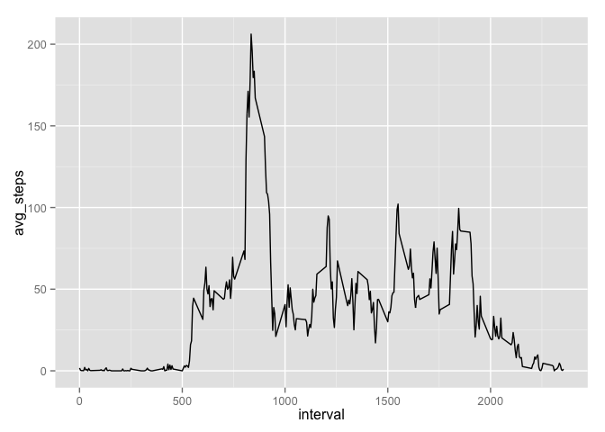

# Reproducible Research: Peer Assessment 1


## Initial Setup


```r
library(dplyr)
```

```
## 
## Attaching package: 'dplyr'
## 
## The following object is masked from 'package:stats':
## 
##     filter
## 
## The following objects are masked from 'package:base':
## 
##     intersect, setdiff, setequal, union
```

```r
library(tidyr)
library(magrittr)
```

```
## 
## Attaching package: 'magrittr'
## 
## The following object is masked from 'package:tidyr':
## 
##     extract
```

```r
library(lubridate)
library(ggplot2)
setwd("~/Dropbox/R/Reproducible Research/RepData_PeerAssessment1")
```

## Loading and preprocessing the data


```r
activity_data<-read.csv("activity.csv")
activity_data$date <- ymd(activity_data$date)
```


## What is mean total number of steps taken per day?

#### 1.Make a histogram of the total number of steps taken each day
Since the assignment says that it's okay to ignore the missing values, I simply filtered these values out during my calculations, note that the value is going to vary as opposed to setting missing values to 0.


```r
total_steps <- activity_data %>%
  filter(!is.na(steps)) %>%
  group_by(date)%>%
  summarise(steps = sum(steps))

ggplot(total_steps, aes(x = steps)) + geom_histogram()
```

 


#### 2.Calculate and report the mean and median total number of steps taken per day


Mean of the steps per day:

```r
mean(total_steps$steps)
```

```
## [1] 10766.19
```
Median of the steps per day:

```r
median(total_steps$steps)
```

```
## [1] 10765
```


## What is the average daily activity pattern?

#### 1. Make a time series plot (i.e. type = "l") of the 5-minute interval (x-axis) and the average number of steps taken, averaged across all days (y-axis)


```r
avg_steps <- activity_data %>%
  filter(!is.na(steps)) %>%
  group_by(interval) %>%
  summarise(avg_steps = mean(steps))

ggplot(avg_steps, aes(x = interval, y = avg_steps)) + geom_line()
```

 

#### 2. Which 5-minute interval, on average across all the days in the dataset, contains the maximum number of steps?


```r
avg_steps[avg_steps$avg_steps == max(avg_steps$avg_steps),]
```

```
## Source: local data frame [1 x 2]
## 
##   interval avg_steps
## 1      835  206.1698
```
At interval 835

## Imputing missing values
#### 1.Calculate and report the total number of missing values in the dataset (i.e. the total number of rows with NAs)


```r
NA_Values <- activity_data %>%
  filter(is.na(activity_data$steps)) %>%
  summarise(count = n())

NA_Values
```

```
##   count
## 1  2304
```

#### 2. Devise a strategy for filling in all of the missing values in the dataset. The strategy does not need to be sophisticated. For example, you could use the mean/median for that day, or the mean for that 5-minute interval, etc.

I'm going to impute missing values using the mean for that day. I will left join the previously calculated avg_steps to the original data frame, and impute the value if the original value is missing.

#### 3. Create a new dataset that is equal to the original dataset but with the missing data filled in.


```r
#left join the original data with the avg_steps data frame, using "interval"
activity_data_new <- left_join(activity_data, avg_steps, by = "interval")

#Imputing NA values using the mean data for that time interval
activity_data_new$steps <-with(activity_data_new, ifelse(is.na(steps),avg_steps,steps))

#Dropping the "avg_steps" column
activity_data_new <- activity_data_new %>%
  select(-avg_steps)
```

#### 4. Make a histogram of the total number of steps taken each day and Calculate and report the mean and median total number of steps taken per day. Do these values differ from the estimates from the first part of the assignment? What is the impact of imputing missing data on the estimates of the total daily number of steps?


```r
total_steps_new <- activity_data_new %>%
  group_by(date)%>%
  summarise(steps = sum(steps))

ggplot(total_steps_new, aes(x = steps)) + geom_histogram()
```

 

Calculating the mean of the total steps taken per day

```r
sprintf("The mean of the total number of steps per day is %s, the mean of the original total number of steps per day is %s, that is a difference of %s",
        round(mean(total_steps_new$steps),1),
        round(mean(total_steps$steps),1),
        round(mean(total_steps_new$steps)-mean(total_steps$steps),1))
```

```
## [1] "The mean of the total number of steps per day is 10766.2, the mean of the original total number of steps per day is 10766.2, that is a difference of 0"
```

Calculating the median of the total steps taken per day

```r
sprintf("The median of the total number of steps per day is %s, the median of the original total number of steps per day is %s, that is a difference of %s",
        round(median(total_steps_new$steps),1),
        round(median(total_steps$steps),1),
        round(median(total_steps_new$steps)-median(total_steps$steps),1))
```

```
## [1] "The median of the total number of steps per day is 10766.2, the median of the original total number of steps per day is 10765, that is a difference of 1.2"
```

## Are there differences in activity patterns between weekdays and weekends?
#### 1. Create a new factor variable in the dataset with two levels – “weekday” and “weekend” indicating whether a given date is a weekday or weekend day.


```r
# Create a weekend vector 
wkends <- c("Saturday","Sunday")

# Creating a new variable to depict weekday or weekend
activity_data_new$wkday <- with(activity_data_new,
                                ifelse(weekdays(date) %in% wkends, "weekend",
                                       "weekday"))
activity_data_new$wkday <- as.factor(activity_data_new$wkday)
```

#### 2. Make a panel plot containing a time series plot (i.e. type = "l") of the 5-minute interval (x-axis) and the average number of steps taken, averaged across all weekday days or weekend days (y-axis). See the README file in the GitHub repository to see an example of what this plot should look like using simulated data.


```r
#calculating avg weekday/end steps count
wksteps <- activity_data_new %>%
  group_by(wkday, interval) %>%
  summarise(steps = mean(steps))

ggplot(wksteps,aes(x = interval, y = steps)) + geom_line() + facet_grid(wkday~.) +
  xlab("5-minute interval") + ylab("Number of steps")
```

 


